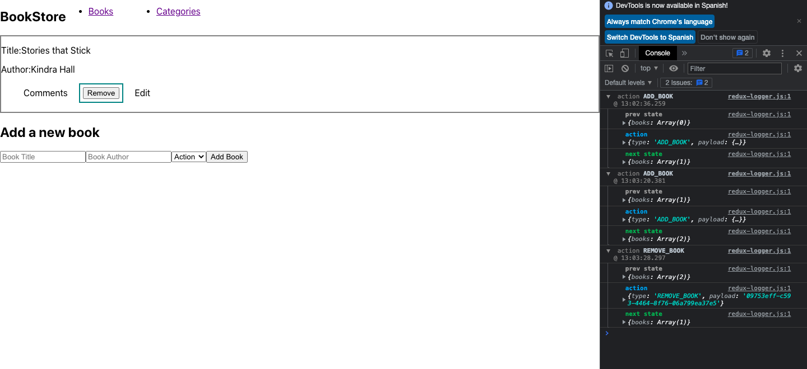

## Bookstore

> Track your lectures.

### Milestone 1:
 - Followed git-flow
 - Added linters
 - Created <code>my-app</code> React App
### Milestone 2:
 - Coded redux store in configureStore.js
 - Added bundles to manage books state and reducers and actions at books.js
 - Followed ducks pattern
 - Added functionality to add a new book to redux state with useDispatch hook
 - Displayed new books from redux state with useSelector hook
 - Added functionality to remove a single book from redux state with useDispatch hook
 - Added logger to track all actions.
### Milestone 3:
 - Installed Axios and Thunks 🍭
 - Added Async functions to use middleware
 - Connected to the API
  - Get data 📚 from the API
  - Post new books in the API 📖
  - Delete books from the API 🚫
 
## Built With

- React-Redux
- Hooks
- React Router
- Visual Studio Code
- Linters

## Set up locally

- Open your terminal and run the following command: <code>git clone https://github.com/AlexRS90/bookstore.git</code>
- Run the command <code>npm install</code>
- Run the command <code>npm start</code>

Once you completed this steps you should see the app running at: http://localhost:3000/ in your browser.

## Author 👤

👤 **Alejandro Ramos**

- GitHub: [@AlexRS90](https://github.com/AlexRS90)
- Twitter: [@AlejandroRBenji](https://twitter.com/AlejandroRBenji)
- LinkedIn: [@AlexRS90](https://www.linkedin.com/in/AlexRS90/)

## 🤝 Contributing

Contributions, issues, and feature requests are welcome!

Feel free to check the [issues page](https://github.com/AlexRS90/bookstore/issues)

## Show your support

Give a ⭐️ if you like this project!

## Acknowledgments

- Hat tip to anyone whose code was used
- Inspiration
- etc

## License

- MIT License